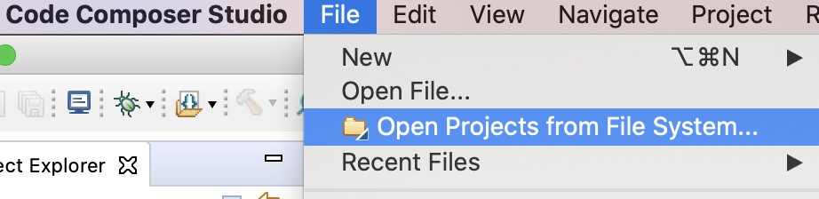
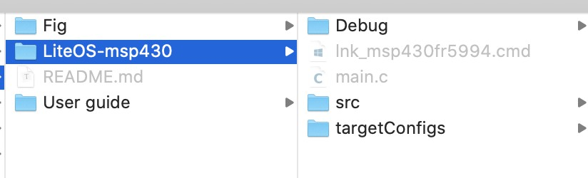

# LiteOS-msp430

1. 本工程现用开发板为MSP430 FR5994

2. 本工程现用[CCS stuido](http://www.ti.com/tool/CCSTUDIO)开发，编译器版本为`TI v18.12.3.LTS`.

3. repository目录结构

   - `\LiteOS-msp430` --- 包含LiteOS内核及工程示例
   - `\User guide` --- 包含MSP430 FR5994开发板的相关说明文档及MSP430编程指南

4. 工程导入过程：

   - STEP1:

     

   - STEP2:

     

   > NOTE: 如果编译出错，可能需要手动更改`include`路径，不过多半不会出现问题。